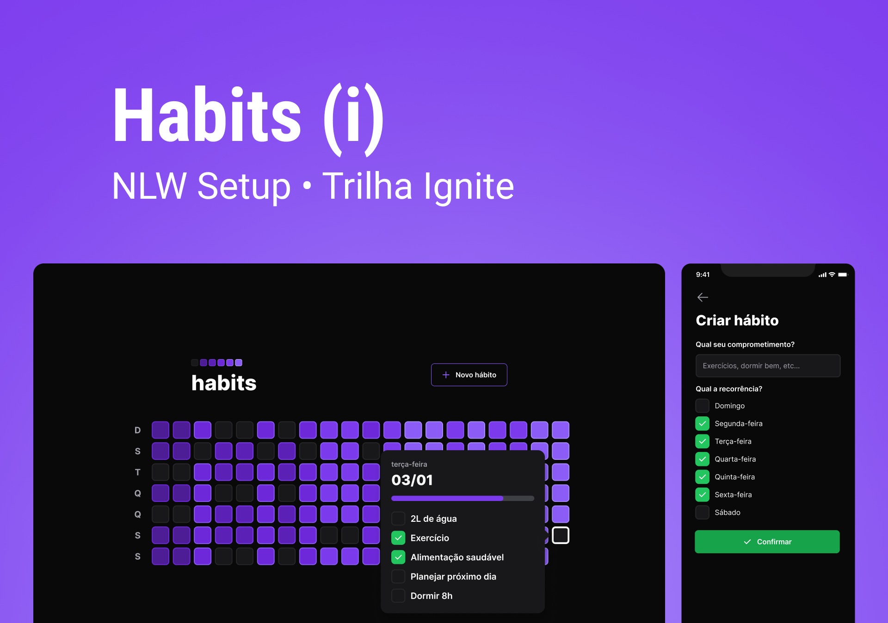

jessicafiel/nlw-setup-ignite

<h1 align="center">Habits</h1>

    Aplicação desenvolvida durante o NLW Setup - Ignite

    <a href="#-tecnologias">Tecnologias</a>&nbsp;&nbsp;&nbsp;|&nbsp;&nbsp;&nbsp;
    <a href="#-layout">Layout</a>

 

    

## 🚀 Tecnologias

Esse projeto foi desenvolvido com as seguintes tecnologias:

Mobile:

- Typescript
- React Native
- Expo
- React Navigation
- Axios
- clsx
- dayjs
- Nativewind
- React Native SVG Transformer
- React Native Reanimated
 

Web: 

- Typescript
- React
- Vite
- Radix UI
- Axios
- clsx
- dayjs
- Tailwind 
 

Server: 

- Typescript
- Fastify 
- Prisma
- dayjs
- Zod
- SQLite

---
## 📋 Layout 

Voce pode visualizar o layout do projeto através [DESSE LINK](https://www.figma.com/file/Oq7MexwlLibZjCcMF1n3OD/Habits-(i)).
